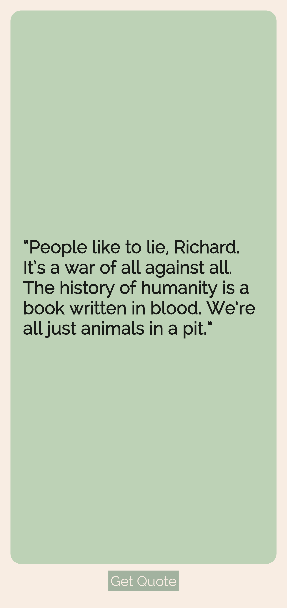

# Quotify

## What was my goal

I wanted to make a Quotes app, and fetch quote from any free quote api.

## TODO

- implement quote api in the project.

## Screenshot

## What I have learned

- How to create Stateful Widgets
- What is the difference between hot reload and hot refresh and running an app from cold
- How to use Containers, Columns, Rows, Cards, Padding etc
- How to add custom fonts
- How to style Text widgets
- How to read and use Flutter Documentation